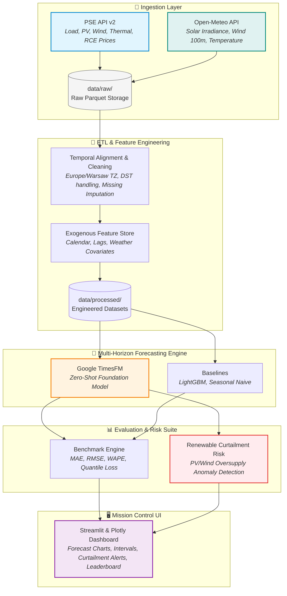

# ⚡ PSE TimesFM Radar: Zero-Shot Power Grid & Renewable Forecasting

[](https://python.org)
[](https://github.com/google-research/timesfm)
[](https://www.pse.pl/dane-systemowe)
[](LICENSE)
[](https://github.com/astral-sh/ruff)

A high-performance multivariate time-series forecasting system benchmarking **Google's TimesFM** (Time Series Foundation Model) zero-shot capabilities against classical baselines (LightGBM, Seasonal Naive) on the **Polish National Power System (PSE - Polskie Sieci Elektroenergetyczne)** and **Open-Meteo** weather reanalysis data.

---

## 🎯 Project Overview & Highlights

- **🔌 Grid Load & Balancing Price Forecasting:** Zero-shot multi-horizon forecasting (24h, 48h, 168h) of national electric load (KSE) and Balancing Market Prices (`RCE` / `CRO`).
- **☀️ Renewable Generation & Curtailment Risk:** Jointly forecasts solar (PV) and wind power generation, alerting to imminent overgeneration events and grid curtailment risks.
- **🌤️ Exogenous Weather Conditioning:** Seamlessly incorporates meteorological covariates (GHI, direct solar radiation, 100m wind speed, 2m temperature, cloud cover) via Open-Meteo APIs.
- **📊 Strict Benchmarking Suite:** Quantifies rolling-window accuracy using MAE, RMSE, WAPE, and quantile pinball loss.
- **🖥️ Interactive Mission Control Dashboard:** Production-ready Streamlit UI providing real-time forecasts, uncertainty intervals, generation mix decomposition, and benchmark leaderboards.

---

## 🏗️ Architecture & Data Pipeline



---

## 📂 Repository Structure

```text
├── data/
│   ├── raw/                 # Raw ingested Parquet files (gitignored)
│   ├── processed/           # Cleaned, time-aligned datasets (gitignored)
│   └── models/              # Cached weights / checkpoints (gitignored)
├── src/
│   ├── ingestion/           # PSE & Open-Meteo API connectors, CLI fetcher
│   │   ├── pse.py           # PSE API client with exponential backoff
│   │   ├── weather.py       # Open-Meteo client for archive & forecast
│   │   └── fetch.py         # Orchestrator & CLI ingestion runner
│   ├── processing/          # Cleaning, resampling, feature engineering
│   ├── models/              # TimesFM wrapper, baselines, evaluation
│   ├── visualization/       # Streamlit UI & Plotly visualization modules
│   ├── config.py            # Pydantic v2 application configuration
│   └── app.py               # Streamlit application entrypoint
├── tests/                   # Pytest suite with mocked network tests
├── scripts/                 # CLI tools, benchmark scripts, runners
├── pyproject.toml           # PEP 621 dependencies & tooling configs
├── Makefile                 # Development tasks (lint, format, test, run)
├── LICENSE                  # MIT License (Krzysztof Pika)
└── README.md                # Project documentation
```

---

## 🚀 Quickstart & Installation

### Prerequisites
- Python 3.11 or 3.12
- [uv](https://github.com/astral-sh/uv) (recommended) or standard `pip`

### 1. Clone the repository
```bash
git clone https://github.com/takzen/timesfm-energy-radar.git
cd timesfm-energy-radar
```

### 2. Set up virtual environment and install dependencies
```bash
# Using uv (fastest)
uv venv --python 3.11
source .venv/bin/activate   # On Windows: .venv\Scripts\activate
uv pip install -e ".[dev]"
```

### 3. Configure environment
```bash
cp .env.example .env
```
Default configuration values in `.env.example` will work out of the box without requiring paid API keys.

---

## 💻 CLI Usage

### Ingest National Grid & Weather Data
Fetch historical and forecast PSE energy metrics along with Open-Meteo weather features:
```bash
# Ingest past 30 days of PSE and weather data
python -m src.ingestion.fetch --days 30

# Ingest specific date range
python -m src.ingestion.fetch --start-date 2026-01-01 --end-date 2026-02-01
```

### Run Quality Verification
```bash
make lint        # Run ruff checks
make format      # Format code with ruff
make typecheck   # Static typecheck with mypy
make test        # Run pytest test suite
```

### Launch Interactive Dashboard
```bash
make run
# or
streamlit run src/app.py
```

---

## 📜 License

Distributed under the **MIT License**. Copyright (c) 2026 Krzysztof Pika. See [LICENSE](LICENSE) for full details.
